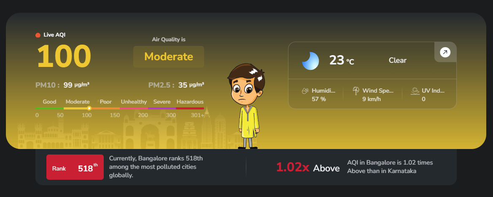
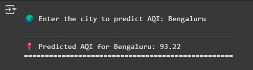

# AQI Prediction using Machine Learning

This project focuses on predicting the Air Quality Index (AQI) using machine learning models. The dataset undergoes data cleaning and preprocessing before training multiple models, including:

- **Linear Regression**
- **Polynomial Linear Regression**
- **Random Forest**
- **Gradient Boosting**

Among these, **Random Forest** was found to be the most effective model due to its high R-squared value and low Mean Squared Error (MSE) compared to the others.

## Dataset
- **Source:** Public air quality monitoring data (`city_day.csv`).
- Contains air quality parameters also known as 'Pollutants' such as PM2.5, PM10, NO, NOX, CO, NO2, SO2, O3, Benzene, Toluene, Xylene.

## Features
- **Real-time AQI Prediction** using trained models
- **Data Preprocessing** for handling missing values and outliers
- **Model Training & Evaluation** to select the best-performing algorithm
- **Integration with WAQI API** to fetch real-time air quality data for any major stations/cities

## Technologies Used
- **Python** (pandas, numpy, scikit-learn, matplotlib, seaborn, xgboost, lightgbm, pickle )
- **Machine Learning Models** (Random Forest, Gradient Boosting, etc.)
- **Jupyter Notebook** for model development
- **WAQI API** for real-time AQI data retrieval

## Model Training & Selection
- The `Air_Quality_Prediction` notebook handles data cleaning and model training.
- The final trained Random Forest model is saved as `random_forest_model.pkl`.
- Other models can also be used for evaluation and comparison based on any feature selection.

## Real-Time AQI Prediction
By integrating with the **WAQI Weather API**, the trained model can predict AQI for major cities in real-time with high accuracy.

## Using Pretrained Model
In order to run the model directly without going through the preprocessing and training phase, the Random Forest model can be downloaded from the repository releases:  
[Pretrained Model Download](https://github.com/AlwaysRead/AQI-Predictor/releases/tag/v1.0) and used directly as pretrained model.

## Comparison  
### Real-Time AQI Value and Predicted AQI  

| Real-Time AQI | Predicted AQI |
|--------------|--------------|
|  |  |

## Future Enhancements
- Implement deep learning models for improved accuracy.
- Develop a web-based dashboard for real-time AQI monitoring. To learn how to deploy the model go to this repo https://github.com/AlphaCfter/binary-brains.git
- Introduce IoT-based real-time data collection.

## Website Release
[Binary Brains AQI](https://binarybrainsaqi.netlify.app/)

## Contact
For queries or contributions email me at: chinmoysaikia61@gmail.com, feel free to reach out or create an issue in the repository.

